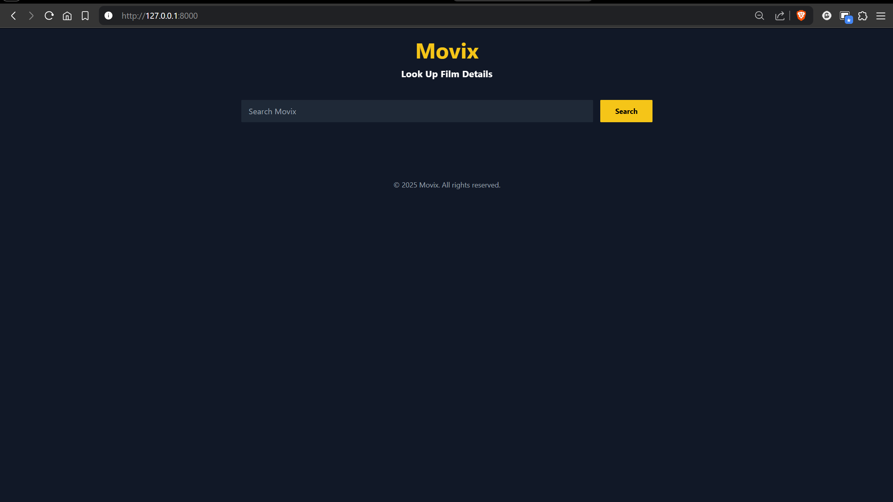
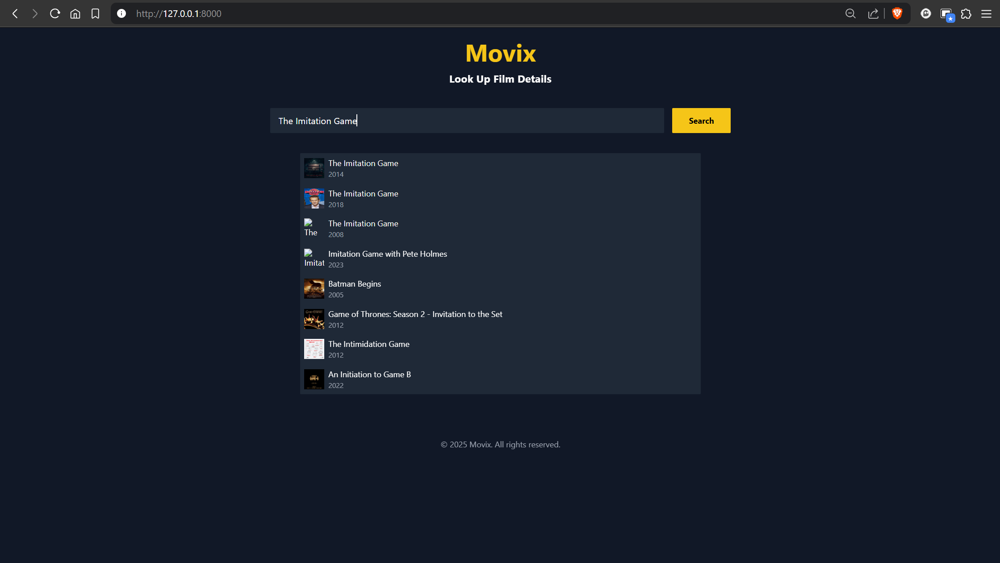
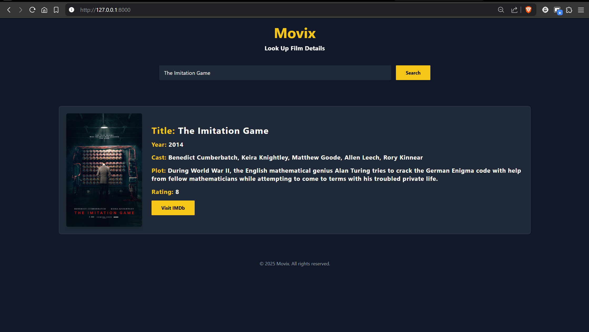

# Movix - Movie Details App

Movix is a Django-based web application that fetches movie details using the IMDb API. It allows users to search for any movie and view details like title, year, runtime, cast, plot, and ratings.

---

## Features
- **Search for Movies**: Enter a movie name to fetch details.
- **Autocomplete Suggestions**: Get real-time suggestions as you type.
- **Movie Details**:
  - Title
  - Year
  - Runtime
  - Cast
  - Plot
  - Ratings
- **IMDb Link**: Direct link to the movie's IMDb page.

---

## Technologies Used
- **Backend**: Django
- **Frontend**: HTML, Tailwind CSS, JavaScript
- **API**: IMDb RapidAPI

---

## Setup

### Prerequisites
- Python 3.x
- Pip (Python package manager)
- IMDb RapidAPI key (get it from [RapidAPI](https://rapidapi.com/apidojo/api/imdb8))

### Steps to Run the Project

1. **Clone the Repository**:
   ```bash
   git clone https://github.com/your-username/movix.git
   cd movix

2. Create a Virtual Environment:
    python -m venv venv

3. Activate the Virtual Environment:
    venv\Scripts\activate

4. Install Dependencies:
    pip install -r requirements.txt

5. Set Up Environment Variables:
   * Create a .env file in the project root directory.
   * Add your IMDb API key:
      IMDB_API_KEY=your_imdb_api_key_here

6. Run Migrations:
    python manage.py migrate

7. Run the Development Server:
    python manage.py runserver

8. Access the Application:
    Open your browser and go to http://127.0.0.1:8000/


##Project Structure
```
movix/
├── movix/
│   ├── settings.py
│   ├── urls.py
│   └── ...
├── movixapp/
│   ├── migrations/
│   ├── static/
│   │   ├── css/
│   │   │   └── styles.css
│   │   └── js/
│   │       └── scripts.js
│   ├── templates/
│   │   └── movixapp/
│   │       └── index.html
│   ├── views.py
│   ├── urls.py
│   └── ...
├── .gitignore
├── README.md
├── manage.py
└── requirements.txt
```

How to Use
1. Open the application in your browser.
2. Enter a movie name in the search bar.
3. Click Search or select a suggestion from the autocomplete dropdown.
4. View the movie details displayed on the page.



